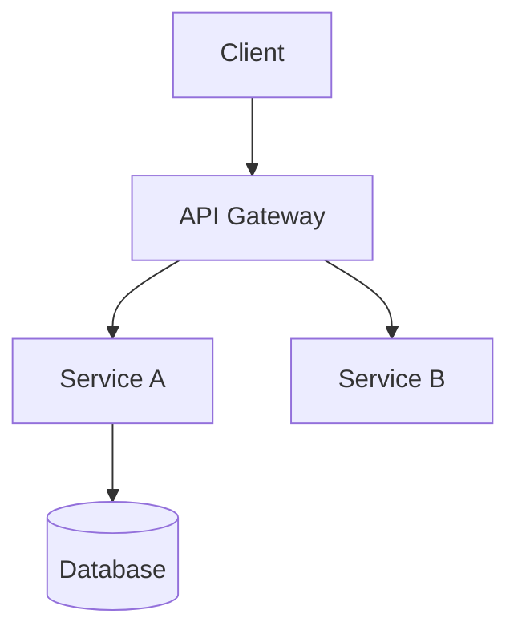

# AI Context Files Implementation Plan

> **For agentic workers:** REQUIRED SUB-SKILL: Use superpowers:subagent-driven-development (recommended) or superpowers:executing-plans to implement this plan task-by-task. Steps use checkbox (`- [ ]`) syntax for tracking.

**Goal:** Create template markdown files that standardize how AI coding agents receive project context — preventing guesswork and inconsistent decisions.

**Architecture:** Each file has a single responsibility. Files are plain Markdown, git-tracked at project root, consumed by AI agents at session start. Templates provide section headings with explanatory comments so the user fills in project-specific content.

**Tech Stack:** Markdown (no tooling dependencies)

## Global Constraints

- All files in project root (or `./docs/` if root is too cluttered)
- Markdown only — no HTML, no custom syntax
- Each file must contain inline guidance explaining what to put in each section
- Files are git-tracked and versioned alongside code
- AGENTS.md must reference all context files at the bottom

---

### Task 1: PRD.md template

**Files:**
- Create: `PRD.md`

**Interfaces:**
- Consumes: nothing
- Produces: `PRD.md` — product requirements template consumed by AI agents at session start

- [ ] **Step 1: Write PRD.md template**

```markdown
# PRD — Product Requirements Document

<!--
This file defines WHAT we're building and WHY.
AI agents read this before generating any code.
Keep it updated as requirements evolve.
-->

## Problem

<!-- One paragraph describing the problem this project solves. -->

## Target Users

<!-- Who uses this? List user personas. -->

## Core Features

<!-- Bullet list of major features. -->
- Feature 1
- Feature 2
- Feature 3

## User Roles / Personas

<!-- List each role and what they can do. -->
- **Role A**: Can do X, Y, Z
- **Role B**: Can do X, Z

## Functional Requirements

<!-- Numbered, testable requirements. Each should be verifiable. -->
1. Users can [do something]
2. System shall [behave some way]
3. Data shall [be treated some way]

## Non-Functional Requirements

<!-- Performance, security, scalability, etc. -->
- [e.g.] Page load < 2s
- [e.g.] 99.9% uptime SLA

## Success Criteria

<!-- Measurable outcomes that define "done". -->
- [ ] Criterion 1
- [ ] Criterion 2

## Out of Scope

<!-- Explicitly what this project will NOT do. -->
- Item 1
- Item 2
```

- [ ] **Step 2: Verify file exists**

Run: `ls -la PRD.md`
Expected: file exists with 300+ bytes

- [ ] **Step 3: Commit**

```bash
git add PRD.md
git commit -m "feat: PRD.md template for AI context"
```

---

### Task 2: ARCHITECTURE.md template

**Files:**
- Create: `ARCHITECTURE.md`

**Interfaces:**
- Consumes: nothing
- Produces: `ARCHITECTURE.md` — architecture blueprint consumed by AI agents

- [ ] **Step 1: Write ARCHITECTURE.md template**

```markdown
# Architecture

<!--
This file defines HOW the system is built.
AI agents read this to understand structure before modifying code.
Keep the folder tree and data flow accurate.
-->

## System Architecture

<!-- Overview diagram (ASCII or Mermaid) -->



## App Flow / Data Flow

<!-- Step-by-step of a typical request through the system. -->
1. User does X
2. System does Y
3. Response returns Z

## Folder Structure

```
project-root/
├── src/
│   ├── components/
│   ├── pages/
│   └── lib/
├── tests/
└── docs/
```

## Tech Stack

<!-- Exact versions where possible. -->
- **Runtime**: Node.js 20+
- **Framework**: Next.js 14
- **Database**: PostgreSQL 16
- **ORM**: Prisma 5
- **Auth**: NextAuth v5

## Database Design

<!-- Key entities and relationships. -->
- **Entity A**: id, name, created_at
  - belongs_to Entity B
- **Entity B**: id, title, entity_a_id

## Auth Flow

<!-- How authentication and authorization work. -->
1. User logs in via [provider]
2. JWT issued with claims: [list]
3. Middleware checks token on every request

## API Patterns

<!-- Conventions for API design. -->
- RESTful endpoints at `/api/v1/`
- Request/response validation via [tool]
- Error format: `{ error: string, code: number }`

## Frontend / Backend Boundaries

<!-- What runs where, how they communicate. -->
- Frontend: [framework], calls API at `/api/`
- Backend: [framework], serves API + SSR
- Real-time: [websocket/SSE]

## Key Design Decisions

<!-- Why certain choices were made. -->
- **Decision 1**: [choice] because [reason]
- **Decision 2**: [choice] because [reason]
```

- [ ] **Step 2: Verify file exists**

Run: `ls -la ARCHITECTURE.md`
Expected: file exists with 500+ bytes

- [ ] **Step 3: Commit**

```bash
git add ARCHITECTURE.md
git commit -m "feat: ARCHITECTURE.md template for AI context"
```

---

### Task 3: RULES.md template

**Files:**
- Create: `RULES.md`

**Interfaces:**
- Produces: `RULES.md` — coding constraints consumed by AI agents

- [ ] **Step 1: Write RULES.md template**

```markdown
# Rules — Coding Constraints

<!--
This file defines boundaries the AI must not cross.
AI agents check this BEFORE writing any code.
Violations should be flagged in code review.
-->

## Required Tech Stack

<!-- Locked versions. AI must not introduce alternatives. -->
- [e.g.] Python 3.11+ only
- [e.g.] React 18 with Next.js 14
- [e.g.] PostgreSQL 16 via Prisma 5

## Approved Libraries

<!-- Only these versions of these libraries. -->
- `requests` >=2.28
- `click` >=8.0

## Forbidden Libraries

<!-- Never use these, even if they solve the problem faster. -->
- `axios` (use `fetch`)
- `lodash` (use native Array/Map/Set)
- any jQuery
- any CSS framework not in approved list

## Naming Conventions

- **Files**: `kebab-case` for config, `PascalCase` for components
- **Classes**: `PascalCase`
- **Functions**: `snake_case` (Python) / `camelCase` (TS/JS)
- **Variables**: `snake_case` (Python) / `camelCase` (TS/JS)
- **Database**: `snake_case` column names

## Error Handling Rules

- All API routes must wrap in try/catch
- Never expose stack traces to clients
- Use typed error classes, not generic `Exception`
- Log errors with structured logging ([tool])

## Security Guidelines

- No hardcoded secrets (use env vars)
- All SQL queries via ORM or parameterized
- CSRF protection on all mutation endpoints
- Rate limiting on auth endpoints
- Validate all user input server-side

## Reusable Component Standards

- Each component in its own file
- Props typed (TypeScript interface or dataclass)
- Max 200 lines per component
- No side effects in render functions

## Files the AI Must Not Touch

<!-- Read-only files. AI may read but never modify. -->
- `./.github/workflows/*`
- `./docker-compose.yml`
- `./.env.example`
- `./AGENTS.md`
- `./CLAUDE.md`

## Limits on Autonomous Decisions

<!-- What requires human approval. -->
- Adding new dependencies requires approval
- Changing database schema requires approval
- Changing CI/CD pipeline requires approval
- Refactoring > 50 lines in a single file requires approval
- Any security-related change requires approval
```

- [ ] **Step 2: Verify file exists**

Run: `ls -la RULES.md`
Expected: file exists with 500+ bytes

- [ ] **Step 3: Commit**

```bash
git add RULES.md
git commit -m "feat: RULES.md template for AI context"
```

---

### Task 4: PHASES.md template

**Files:**
- Create: `PHASES.md`

**Interfaces:**
- Produces: `PHASES.md` — phased implementation plan consumed by AI agents

- [ ] **Step 1: Write PHASES.md template**

```markdown
# Phases — Implementation Plan

<!--
This file breaks the project into build phases.
AI agents use this to understand what to build now vs later.
Don't build Phase N+1 before Phase N is done.
-->

## Phase 1: [Name]

**Scope:** What gets built in this phase.

**Dependencies:** What must exist before this starts.

**Done Criteria:**
- [ ] Criterion 1
- [ ] Criterion 2
- [ ] All tests pass
- [ ] Code reviewed and merged

---

## Phase 2: [Name]

**Scope:** What gets built in this phase.

**Dependencies:** Phase 1 complete

**Done Criteria:**
- [ ] Criterion 1
- [ ] Criterion 2

---

## Phase 3: [Name]

**Scope:** What gets built in this phase.

**Dependencies:** Phase 2 complete

**Done Criteria:**
- [ ] Criterion 1
- [ ] Criterion 2

---

## Phase 4: [Optional — Name]

**Scope:**

**Dependencies:**

**Done Criteria:**
- [ ] Criterion 1

---

## Phase 5: Testing & Cleanup

**Scope:** Final polish before launch.

**Dependencies:** All previous phases complete

**Done Criteria:**
- [ ] Full test suite passes
- [ ] No known critical bugs
- [ ] Performance benchmarks met
- [ ] Documentation complete
```

- [ ] **Step 2: Verify file exists**

Run: `ls -la PHASES.md`
Expected: file exists with 300+ bytes

- [ ] **Step 3: Commit**

```bash
git add PHASES.md
git commit -m "feat: PHASES.md template for AI context"
```

---

### Task 5: DESIGN.md template

**Files:**
- Create: `DESIGN.md`

**Interfaces:**
- Produces: `DESIGN.md` — design system consumed by AI agents (UI projects only)

- [ ] **Step 1: Write DESIGN.md template**

```markdown
# Design — Design System

<!--
This file defines how the UI looks and behaves.
AI agents read this to generate consistent UI components.
Skip this file for non-UI / backend-only projects.
-->

## Colors & Themes

- **Primary**: `#...` (hex)
- **Secondary**: `#...`
- **Background**: `#...`
- **Text**: `#...`
- **Error**: `#...`
- **Success**: `#...`

<!-- Include dark theme values if applicable. -->

## Typography

- **Font stack**: `Inter, system-ui, sans-serif`
- **Headings**: [size, weight, line-height]
- **Body**: [size, weight, line-height]
- **Monospace**: [font, size]

## Spacing System

<!-- Define the spacing scale. -->
- Base unit: 4px or 8px
- Scale: 4px, 8px, 12px, 16px, 24px, 32px, 48px, 64px

## Border Radius

- **Small**: 4px
- **Medium**: 8px
- **Large**: 12px
- **Full**: 9999px (pills)

## Shadows / Elevation

- **Level 1**: `0 1px 2px rgba(0,0,0,0.1)`
- **Level 2**: `0 4px 6px rgba(0,0,0,0.1)`
- **Level 3**: `0 10px 15px rgba(0,0,0,0.1)`

## Component Behavior

<!-- Describe interaction patterns. -->
- **Buttons**: hover → darken 10%, active → scale(0.97), disabled → opacity 0.5
- **Inputs**: focus → primary border + shadow, error → red border
- **Links**: underline on hover, visited → muted

## Breakpoints

- **Mobile**: 0-639px
- **Tablet**: 640-1023px
- **Desktop**: 1024px+

## Accessibility Rules

- WCAG 2.1 AA minimum
- All interactive elements focusable and have visible focus ring
- Color contrast ratio ≥ 4.5:1 for text
- Images have `alt` text
- Forms have labels
```

- [ ] **Step 2: Verify file exists**

Run: `ls -la DESIGN.md`
Expected: file exists with 400+ bytes

- [ ] **Step 3: Commit**

```bash
git add DESIGN.md
git commit -m "feat: DESIGN.md template for AI context"
```

---

### Task 6: MEMORY.md template

**Files:**
- Create: `MEMORY.md`

**Interfaces:**
- Produces: `MEMORY.md` — project state tracker consumed and updated by AI agents

- [ ] **Step 1: Write MEMORY.md template**

```markdown
# Memory — Project State

<!--
This file tracks what's happened and what's next.
AI agents READ at session start and WRITE at session end.
Keep it brief — bullet points, not paragraphs.
-->

## What's Done

<!-- Completed features and milestones. -->
- [x] Feature A (2026-01-15)
- [x] Feature B (2026-01-20)

## Current Phase

<!-- Which phase from PHASES.md is active. -->
**Phase 2: [Name]**

## Active Work

<!-- What's being worked on right now. -->
- [ ] Task 1 — in progress
- [ ] Task 2 — not started

## Key Decisions

<!-- Recent decisions that future agents must not undo. -->
- **2026-01-20**: Chose [X] over [Y] because [reason]

## Known Issues

<!-- Bugs or blockers. -->
- Issue 1: [description] → [workaround if any]
- Issue 2: [description]

## Open Tasks

<!-- Not yet started. -->
- [ ] Task A
- [ ] Task B

## Next Step

<!-- The single next thing to do. Update this at session end. -->
- [ ] [Next action]
```

- [ ] **Step 2: Verify file exists**

Run: `ls -la MEMORY.md`
Expected: file exists with 300+ bytes

- [ ] **Step 3: Commit**

```bash
git add MEMORY.md
git commit -m "feat: MEMORY.md template for AI context"
```

---

### Task 7: TESTING.md template (optional)

**Files:**
- Create: `TESTING.md`

**Interfaces:**
- Produces: `TESTING.md` — testing guide consumed by AI agents

- [ ] **Step 1: Write TESTING.md template**

```markdown
# Testing — Guide

<!--
AI agents read this to write consistent tests.
Define strategy, coverage targets, and critical flows.
-->

## Testing Strategy

- **Unit tests**: [framework], all utility/helper functions
- **Integration tests**: [framework], API endpoints, DB queries
- **E2E**: [framework/tool], critical user journeys
- **Coverage target**: [e.g.] 80% minimum

## Critical Flows to Test

<!-- Every PR must not break these. -->
1. User registration and login
2. Core CRUD for main entity
3. Payment flow (if applicable)
4. Error states (network failure, invalid input)
5. Empty states (no data)

## Edge Cases

<!-- Things that are easy to miss. -->
- Concurrent access / race conditions
- Large payloads
- Unicode / special characters in input
- Rate limiting behavior
- Session expiry

## Validation Rules

<!-- Input/output validation that must be tested. -->
- Email format validation
- Password minimum length (8 chars)
- Required fields return 400
- SQL injection attempts return 400

## Pre-Release Checklist

- [ ] Full test suite passes
- [ ] No P0/P1 bugs open
- [ ] Coverage meets threshold
- [ ] Smoke test on staging
- [ ] Performance test passes
```

- [ ] **Step 2: Verify file exists**

Run: `ls -la TESTING.md`
Expected: file exists with 300+ bytes

- [ ] **Step 3: Commit**

```bash
git add TESTING.md
git commit -m "feat: TESTING.md template for AI context"
```

---

### Task 8: DECISIONS.md template (optional)

**Files:**
- Create: `DECISIONS.md`

**Interfaces:**
- Produces: `DECISIONS.md` — decision log consumed by AI agents

- [ ] **Step 1: Write DECISIONS.md template**

```markdown
# Decisions — Architecture Decision Log

<!--
This file logs important decisions and why they were made.
Append-only — new entries go at TOP.
Prevents future AI sessions from undoing intentional choices.
-->

## [YYYY-MM-DD] Decision Title

**Status:** Accepted / Superseded / Rejected

**Context:** What prompted this decision.

**Decision:** What was chosen.

**Rationale:** Why this choice over alternatives.

**Alternatives Considered:**
- Alternative A: pros / cons
- Alternative B: pros / cons

**Consequences:** What this decision affects.

---

## [YYYY-MM-DD] Decision Title

**Status:** Accepted

**Context:**

**Decision:**

**Rationale:**

**Alternatives Considered:**

**Consequences:**
```

- [ ] **Step 2: Verify file exists**

Run: `ls -la DECISIONS.md`
Expected: file exists with 300+ bytes

- [ ] **Step 3: Commit**

```bash
git add DECISIONS.md
git commit -m "feat: DECISIONS.md template for AI context"
```

---

### Task 9: Update AGENTS.md to reference new context files

**Files:**
- Modify: `AGENTS.md` (append section at end)

**Interfaces:**
- Consumes: all created template files
- Produces: updated AGENTS.md that AI agents read to discover context files

- [ ] **Step 1: Add context file references to AGENTS.md**

Append to the end of `AGENTS.md`:

```markdown

---

## AI Context Files

The following files define project context for AI coding agents. Read them at session start:

| File | Purpose |
|------|---------|
| `PRD.md` | Product requirements — what we're building and why |
| `ARCHITECTURE.md` | Technical blueprint — how the system is built |
| `RULES.md` | Coding constraints — boundaries the AI must not cross |
| `PHASES.md` | Implementation plan — what to build now vs later |
| `DESIGN.md` | Design system — UI colors, typography, spacing |
| `MEMORY.md` | Project state — what's done, active, and next |
| `TESTING.md` | Testing guide — strategy, critical flows, edge cases |
| `DECISIONS.md` | Decision log — why past choices were made |

**IMPORTANT:** AI agents MUST read `MEMORY.md` at session start and update it at session end.
```

- [ ] **Step 2: Verify AGENTS.md updated**

Run: `grep -c "AI Context Files" AGENTS.md`
Expected: 1 (section was added)

- [ ] **Step 3: Commit**

```bash
git add AGENTS.md
git commit -m "feat: add AI context file references to AGENTS.md"
```

---

### Task 10: Final verification

- [ ] **Step 1: Verify all files exist**

```bash
ls -la PRD.md ARCHITECTURE.md RULES.md PHASES.md DESIGN.md MEMORY.md TESTING.md DECISIONS.md AGENTS.md
```

Expected: all 9 files listed with non-zero sizes

- [ ] **Step 2: Verify AGENTS.md references are correct**

```bash
grep -c "PRD.md" AGENTS.md && grep -c "ARCHITECTURE.md" AGENTS.md && grep -c "RULES.md" AGENTS.md
```

Expected: 1 for each (all found)

- [ ] **Step 3: Show final git status**

```bash
git status
```

Expected: clean working directory (all changes committed)
