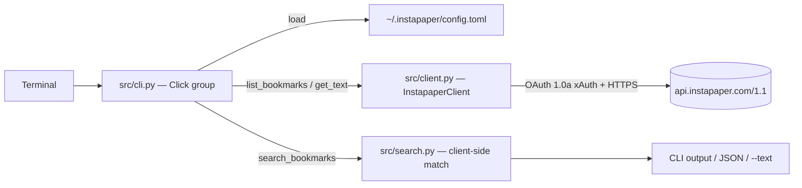

# Instapaper CLI — Quickstart

A Python CLI to search and retrieve your Instapaper bookmarks from the command line.

## What This Wiki Covers

This single-page wiki is the entry point. Deeper pages (architecture overview, source map, workflows, domain concepts, operations runbook, testing guidance, integration notes) are listed in the [Backlog](#backlog) and will be promoted as the codebase grows.

## Quick Setup

```bash
# 1. Install
pip install -e .

# 2. Register an app at https://www.instapaper.com/developers
#    Get your consumer key and secret

# 3. Configure
instapaper configure
# Enter: consumer key, consumer secret, email, password
```

## Quick Usage

```bash
# Search unread bookmarks (default)
instapaper search python

# Search starred folder, limit 100
instapaper search "machine learning" --folder starred --limit 100

# Output JSON
instapaper search cooking --json

# Fetch full article text for result #1
instapaper search rust --text 1

# Search all folders, fetch all pages, deep search article text
instapaper search rust --folder all --fetch-all --deep
```

## Key Options

| Flag | Description |
|------|-------------|
| `--folder` | Folder scope: `unread` (default), `starred`, `archive`, or custom folder name |
| `--limit N` | Max results per page (1–500, default 50) |
| `--fetch-all` | Fetch all pages via `offset` pagination (overrides `--limit` to 500/page) |
| `--deep` | Fetch full article text for each result (1 API call/result); cached bodies are reused by `--text N` without a second round-trip |
| `--json` | Output raw JSON |
| `--text N` | Print full article text for result N (reuses `--deep` cache when available) |

## Architecture at a Glance


*Caption: request path from terminal through CLI, client, and local search to results.*

- **Entry**: `src/cli.py` — Click group with `configure` and `search` commands
- **Config**: `src/config.py` — TOML at `~/.instapaper/config.toml` (chmod 600)
- **Client**: `src/client.py` — `InstapaperClient` (OAuth 1.0a xAuth; `list_bookmarks` accepts `offset` and unwraps the `{"bookmarks": [...]}` response envelope)
- **Search**: `src/search.py` — Client-side substring match (no API search endpoint); accepts an optional `bodies` dict for `--deep` article-text search
- **Pagination**: `--fetch-all` loops `list_bookmarks` with `offset=0,500,1000,…` until a short page is returned

## Key Concepts

- **No API search**: Instapaper API has no search endpoint → client fetches bookmarks then filters locally
- **xAuth**: Email/password exchange for OAuth tokens (no browser redirect)
- **Folders**: `unread`, `starred`, `archive`, or custom folder names
- **Deep search**: `--deep` fetches full article text via `bookmarks/get_text` (1 API call per result)

## Continuous Integration

Four GitHub Actions workflows live under `.github/workflows/`:

| Workflow | Trigger | What it runs |
|----------|---------|--------------|
| `python-app.yml` | push / PR to `main` | installs the package + `requests-mock`, runs `flake8` (syntax + complexity checks, `--exit-zero`) and `pytest` on Python 3.10 |
| `pylint.yml` | push | runs `pylint --exit-zero` over all tracked `*.py` files on Python 3.10 |
| `bandit.yml` | push / PR to `main` + weekly cron (Thu 05:36 UTC) | Bandit security scan, uploads SARIF to the Security tab (`exit_zero: true`) |
| `openwiki-update.yml` | `workflow_dispatch` + daily cron (08:00 UTC) | runs `openwiki code --update --print` and opens a `docs: update OpenWiki` PR via `peter-evans/create-pull-request` |

All lint workflows use `--exit-zero`, so findings surface as warnings rather than blocking merges.

## Repository Layout

Beyond the source tree, the repo contains scaffolding that is generated or local-only and therefore not part of the runtime:

- `src/`, `tests/`, `pyproject.toml` — the installable package and its tests
- `docs/superpowers/{plans,specs}/` — dated design and plan documents (e.g. the 2026-07-27 AI context files design)
- `graphify-out/` — generated dependency graph cache (manifest, `GRAPH_REPORT.md`, `graph.html`/`graph.json`); safe to delete and regenerate
- `.github/workflows/` — the four CI workflows listed above
- **Local-only context files** (listed in `.gitignore`): `AGENTS.md`, `CLAUDE.md`, `MEMORY.md`, `PHASES.md`, `PRD.md`, `TESTING.md`, `ARCHITECTURE.md`, `RULES.md`, `DECISIONS.md`, `DESIGN.md`. These may exist on individual checkouts for AI-agent context but are not tracked.

## Next Steps

- Read the source: [`src/cli.py`](/src/cli.py), [`src/client.py`](/src/client.py), [`src/search.py`](/src/search.py), [`src/config.py`](/src/config.py)
- Re-run the suite: `pytest tests/`
- Promote pages from the [Backlog](#backlog) below as the codebase grows

## Backlog

Deeper pages are deferred until the next init/update. Each is grounded in a real source area:

- `architecture/overview.md` — system components and data flow (`src/cli.py`, `src/client.py`)
- `architecture/source-map.md` — file-by-file map (`src/`, `tests/`)
- `workflows/key-workflows.md` — `configure` and `search` end-to-end flows
- `domain/concepts.md` — Instapaper API, xAuth, folders, envelopes, pagination
- `operations/runbook.md` — config location (`~/.instapaper/config.toml`), auth troubleshooting
- `testing/guidance.md` — `tests/test_cli.py`, `tests/test_client.py`, `tests/test_config.py`, `tests/test_search.py`
- `integrations/instapaper-api.md` — endpoints (`/bookmarks/list`, `/bookmarks/get_text`, `/folders/list`, `/oauth/access_token`) and rate limits